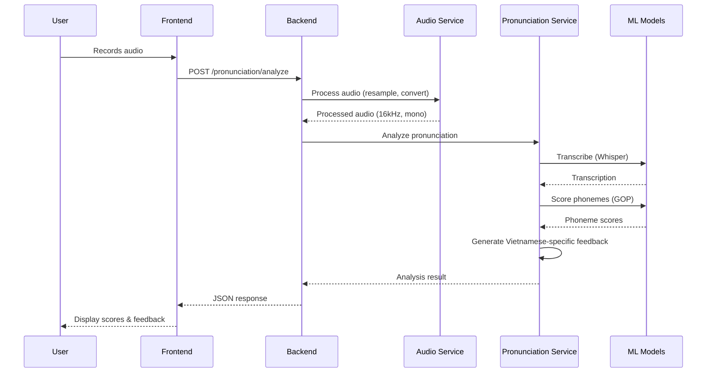

# Architecture Overview

## System Architecture

VietSpeak AI follows a modular monorepo architecture designed for scalability and maintainability.

```
┌─────────────────────────────────────────────────────────────────────────────┐
│                              Client Layer                                    │
├─────────────────────────────────────────────────────────────────────────────┤
│  ┌─────────────────┐    ┌─────────────────┐    ┌─────────────────┐          │
│  │   Web Browser   │    │  Claude Desktop │    │   Mobile App    │          │
│  │   (Next.js)     │    │   (MCP Client)  │    │   (Future)      │          │
│  └────────┬────────┘    └────────┬────────┘    └────────┬────────┘          │
└───────────┼──────────────────────┼──────────────────────┼───────────────────┘
            │ HTTP/WebSocket       │ MCP Protocol         │
            ▼                      ▼                      ▼
┌─────────────────────────────────────────────────────────────────────────────┐
│                              API Layer                                       │
├─────────────────────────────────────────────────────────────────────────────┤
│  ┌─────────────────────────────┐    ┌─────────────────────────────┐         │
│  │      FastAPI Backend        │    │       MCP Server            │         │
│  │  ┌─────────────────────┐   │    │  ┌─────────────────────┐    │         │
│  │  │ REST API Endpoints  │   │    │  │ Tool Handlers       │    │         │
│  │  │ - /pronunciation    │   │    │  │ - analyze_pron      │    │         │
│  │  │ - /audio            │   │    │  │ - transcribe        │    │         │
│  │  │ - /health           │   │    │  │ - get_feedback      │    │         │
│  │  └─────────────────────┘   │    │  └─────────────────────┘    │         │
│  └──────────────┬──────────────┘    └──────────────┬──────────────┘         │
└─────────────────┼───────────────────────────────────┼───────────────────────┘
                  │                                   │
                  ▼                                   ▼
┌─────────────────────────────────────────────────────────────────────────────┐
│                            Service Layer                                     │
├─────────────────────────────────────────────────────────────────────────────┤
│  ┌─────────────────┐    ┌─────────────────┐    ┌─────────────────┐          │
│  │ Pronunciation   │    │     Audio       │    │   Feedback      │          │
│  │    Service      │    │    Service      │    │   Service       │          │
│  └────────┬────────┘    └────────┬────────┘    └────────┬────────┘          │
└───────────┼──────────────────────┼──────────────────────┼───────────────────┘
            │                      │                      │
            ▼                      ▼                      ▼
┌─────────────────────────────────────────────────────────────────────────────┐
│                              ML Layer                                        │
├─────────────────────────────────────────────────────────────────────────────┤
│  ┌─────────────────┐    ┌─────────────────┐    ┌─────────────────┐          │
│  │  Whisper ASR    │    │    GOP Scorer   │    │ G2P Phonemizer  │          │
│  │  (faster-       │    │  (Wav2Vec2      │    │                 │          │
│  │   whisper)      │    │   fine-tuned)   │    │                 │          │
│  └─────────────────┘    └─────────────────┘    └─────────────────┘          │
└─────────────────────────────────────────────────────────────────────────────┘
```

## Key Design Decisions

### 1. Monorepo Structure
- **Why**: Simplified dependency management, atomic changes across services
- **Trade-off**: Larger repository size, requires proper tooling (Turborepo)

### 2. FastAPI for Backend
- **Why**: Async support, automatic OpenAPI docs, Python ML ecosystem
- **Trade-off**: Python's GIL requires careful async handling

### 3. MCP Integration
- **Why**: Future-proof LLM integration, direct tool access for AI assistants
- **Trade-off**: Additional complexity, emerging protocol

### 4. Whisper for ASR
- **Why**: State-of-the-art accuracy, multilingual support
- **Trade-off**: Requires GPU for real-time, larger model sizes

## Data Flow

### Pronunciation Analysis Flow



## Technology Stack

| Layer | Technology | Purpose |
|-------|------------|---------|
| Frontend | Next.js 14 | React framework with SSR |
| Backend | FastAPI | Async Python web framework |
| ML | PyTorch, Whisper, Wav2Vec2 | Speech processing |
| Database | PostgreSQL | Persistent storage |
| Cache | Redis | Session & result caching |
| MCP | MCP SDK | LLM tool integration |
| Container | Docker | Containerization |
| CI/CD | GitHub Actions | Automation |

## Architecture Decision Records (ADRs)

See [adr/](adr/) directory for detailed decision records:

- ADR-001: Monorepo vs Polyrepo
- ADR-002: Choice of ASR Model
- ADR-003: MCP Integration Strategy
- ADR-004: Vietnamese Interference Detection Approach
